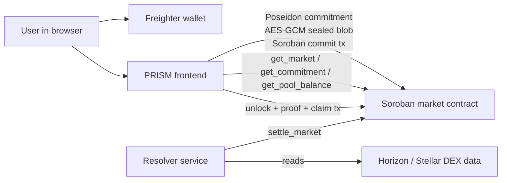
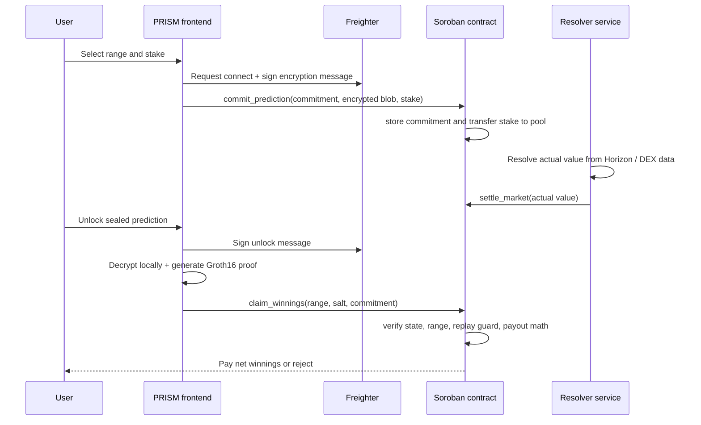
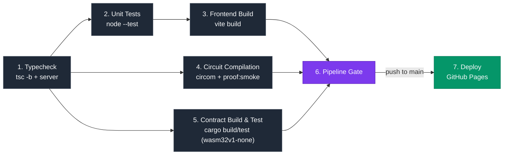

# PRISM

A Real World Asset (RWA) project: private range prediction
markets on Stellar.

Instead of betting yes or no, you predict a numeric range.
Tighter range = higher multiplier. Your prediction stays
sealed until settlement — then you prove it was right.

> This codebase ships with a live testnet deployment
> (contract ID and account below) so it runs out of the box
> after `npm install`. To cut over to your own deployment,
> follow [Deploying From Scratch](#deploying-from-scratch).

## How It Works

1. Pick a market with a numeric outcome
2. Choose a range — your prediction is sealed as a
   Poseidon hash commitment on Stellar. Nobody sees
   your range.
3. Stake XLM — transferred to the contract pool on-chain
4. Market settles from live Stellar Horizon data
5. Unlock your sealed prediction, generate a Groth16 ZK
   proof locally, then submit a claim — the contract
   validates the range and pays out

## Why ZK Is Essential

Without ZK, range prediction markets break. The moment
you place a bet, everyone can see your range. Skilled
forecasters get copied instantly. The precision multiplier
— which rewards tighter ranges — becomes worthless because
anyone can wait and copy the tightest visible range.

With ZK, your range is sealed as a cryptographic
commitment before settlement. Copying is mathematically
impossible — you can see there's a commitment, but you
cannot see what range it represents. At claim time, you
generate a Groth16 proof locally that proves two things
without revealing them early: your commitment matches
your actual range, and the settled result falls inside it.

ZK is not a privacy feature added on top. It is the
reason the core mechanic works at all.

## Architecture





### Runtime Boundaries

| Layer | Responsibility |
|---|---|
| Frontend | Range entry, wallet connection, encryption, proof generation, claim UX, live polling |
| Freighter | Wallet authorization, transaction signing, encryption-message signing |
| Soroban contract | Market state, stake custody, settlement state, payout logic, nullifier checks |
| Resolver service | Reads public Stellar data and posts settlement to the contract |
| Horizon / DEX | Source data for the two live Stellar Metrics markets |

## Why Stellar Specifically

**Stellar-native data:** PRISM's Stellar Metrics markets
settle from Horizon API data — total XLM payment volume
and the XLM/USDC price from the SDEX. An authenticated
resolver fetches this public data and posts the result to
the Soroban contract. Anyone can independently verify the
source value.

**BN254/Poseidon host functions:** Stellar Protocol 25
introduced native BN254 elliptic curve operations
(CAP-0074) and Poseidon/Poseidon2 hashing (CAP-0075)
as host functions. These are the exact primitives PRISM's
ZK stack uses. On-chain Groth16 verification is the
production upgrade path — the contract and circuit are
structured to support it.

**Low fees:** Soroban's near-zero transaction costs make
micro-predictions economically viable. A 5 XLM minimum
stake is practical because fees don't eat into returns.

**Freighter wallet:** Native Stellar wallet integration
for both transaction signing and deterministic encryption
key derivation.

## Data Flow

1. The UI reads market state from the Soroban contract.
2. The user selects a range and stake.
3. The frontend generates a Poseidon commitment in the browser.
4. The frontend encrypts the full prediction blob with a key derived from a Freighter signature.
5. The contract stores the commitment, encrypted blob, and stake.
6. The resolver posts the resolved value from public Stellar data.
7. The user unlocks the sealed prediction locally and generates a Groth16 proof in the browser.
8. The contract checks the stored commitment, range, settlement state, and duplicate-claim guard before paying out.

## What Is Real vs Not Yet Wired

| Component | Status |
|---|---|
| Circom range_market circuit | Real |
| snarkjs Groth16 proof generation in browser | Real |
| Local proof verification via snarkjs | Real |
| Poseidon commitment stored on Soroban | Real |
| AES-GCM prediction encryption via Freighter signature | Real |
| XLM stake transfer to contract | Real — testnet |
| Pool-based payout with 2% fee | Real — testnet |
| Duplicate claim prevention via nullifier | Real |
| Settlement rejection for missed ranges | Real |
| Horizon oracle for XLM payment volume | Real |
| Horizon/SDEX oracle for XLM/USDC price | Real |
| BN254 on-chain Groth16 proof verification | Not yet wired — see below |

## Current Limitation

The Soroban contract does not yet verify the Groth16
proof on-chain. The contract enforces commitment storage,
settlement state, range validation, payout math, and
duplicate prevention — but a modified client could
theoretically submit a different winning range.


The contract and circuit are structured to support BN254
on-chain verification via Stellar's CAP-0074 host
functions once a compatible verifier contract is
available. The verifier investigation is reproducible with
`scripts/verifier-smoke-test.ts`.

Proof generation and local verification are real, and
Soroban enforces all state transitions.

## Repo Map

- [`src/App.tsx`](./src/App.tsx) - routes, page composition, prediction flow, claim flow, and resolver polling.
- [`src/lib/commitment.ts`](./src/lib/commitment.ts) - Poseidon commitment generation.
- [`src/lib/crypto/prediction-encryption.ts`](./src/lib/crypto/prediction-encryption.ts) - Freighter signature-derived encryption.
- [`src/lib/contract/prism-market.ts`](./src/lib/contract/prism-market.ts) - generated contract client wrapper.
- [`contracts/prism_market/src/lib.rs`](./contracts/prism_market/src/lib.rs) - Soroban contract.
- [`server/resolvers.ts`](./server/resolvers.ts) - authenticated resolver logic.
- [`scripts/resolve-xlm-payments.ts`](./scripts/resolve-xlm-payments.ts) - CLI resolver entrypoint for XLM payments.
- [`scripts/resolve-xlm-usdc-price.ts`](./scripts/resolve-xlm-usdc-price.ts) - CLI resolver entrypoint for XLM/USDC.
- [`scripts/integration-test.ts`](./scripts/integration-test.ts) - live testnet scenarios.
- [`scripts/deploy-markets.ts`](./scripts/deploy-markets.ts) - creates and funds all 9 production markets on a fresh contract deployment.

## Payout Formula

```text
width = high - low

raw_multiplier = floor(max_range_width / width) - 1

multiplier = max(1, min(raw_multiplier, max_multiplier))

gross_payout = stake × multiplier

fee = gross_payout × 2%

net_payout = gross_payout - fee
```

Example: 10 XLM stake, range width 50, max width 1000
→ raw_multiplier = floor(1000 / 50) - 1 = 19
→ multiplier = max(1, min(19, 10)) = 10x
→ gross = 100 XLM, fee = 2 XLM, net = 98 XLM

Example: 10 XLM stake, range width 454, max width 1000
→ raw_multiplier = floor(1000 / 454) - 1 = 1
→ multiplier = 1x
→ gross = 10 XLM, fee = 0.2 XLM, net = 9.8 XLM

This formula applies to every market on the deployed
contract. Wide ranges can still win, but they no longer
earn a bonus multiplier. The multiplier only becomes
meaningful when the selected range is materially tighter
than the market's full allowed range.

Losing stakes remain in the contract pool and fund
future winning payouts.

## Crypto Market Bands

Crypto markets use practical forecast bands based on live
CoinGecko spot prices fetched during deployment. The bands
are intentionally wide enough to be fair for a volatile
forecast, but not so wide that obvious safe ranges earn
large multipliers.

| Market | Spot used | Forecast band | Max range width |
|---|---:|---:|---:|
| BTC | ~$60,266 | $30,000-$130,000 | 100,000 |
| ETH | ~$1,583 | $800-$4,000 | 3,200 |
| SOL | ~$71.50 | $25-$250 | 225 |
| XLM | ~$0.1743 | $0.0500-$0.5000 | 4,500 scaled |
| DOGE | ~$0.0751 | $0.0250-$0.3000 | 2,750 scaled |
| HYPE | ~$62.70 | $20-$160 | 140 |

Example: an ETH prediction of $1,040-$3,217 has width
2,177. With a max width of 3,200:

```text
raw_multiplier = floor(3200 / 2177) - 1 = 0
multiplier = 1x
```

That broad range can still win, but it does not receive
a bonus payout.

## Stack Map

```text
React frontend (Vite + TypeScript + shadcn)
├── Freighter wallet connection
├── Poseidon commitment generation (circomlibjs)
├── AES-GCM encryption (Freighter sig → HKDF → key)
├── Groth16 proof generation (snarkjs in browser)
└── Soroban contract calls

Soroban contract (Rust)
├── Market configuration and pool accounting
├── Commitment + encrypted blob storage
├── Settlement enforcement
├── Payout calculation and transfer
└── Nullifier-based duplicate prevention

Resolver service (Express + TypeScript)
├── Authenticated settlement endpoints
├── Horizon and SDEX metric collection
├── Stellar SDK transaction signing
└── Shared logic used by local resolver scripts

Circom circuit
└── circuits/range_market.circom
```

## Path to Mainnet

- Replace testnet XLM with USDC stakes
- Wire BN254 Groth16 verifier using CAP-0074 host functions
- Decentralized resolver network for trustless settlement
- Stellar anchor integration for fiat deposit/withdrawal
- Additional Stellar Metrics markets — SDEX volume,
  anchor TVL, corridor payment flows
- PRISM markets about Stellar's own metrics create a
  feedback loop: network growth makes markets more
  interesting and more liquid

## How to Run Locally

```bash
git clone <your-repository-url>
cd Prism
npm install
cp .env.example .env
npm run dev
```

`.env.example` already points at the live testnet deployment
listed under [Deployed Contracts](#deployed-contracts-testnet),
so the app works immediately with no contract setup required.
To run the resolver locally you additionally need
`RESOLVER_SECRET` set in `.env` — this is the secret key for
the resolver account, kept server-side only. The demo
deployment's resolver secret is not published here; set your
own account as `PRISM_RESOLVER_ADDRESS` / `RESOLVER_SECRET` if
you want to settle markets yourself, or follow
[Deploying From Scratch](#deploying-from-scratch) to stand up
your own contract end to end.

```bash
npm run resolve:xlm-payments -- --max-pages=1
npm run resolve:xlm-payments -- --market-id=3011 --max-pages=1
npm run resolve:xlm-usdc
```

The deployed resolver exposes:

```text
GET  /health
POST /resolve/xlm-payments
POST /resolve/xlm-usdc
POST /resolve/crypto-price
```

Settlement endpoints require `RESOLVER_ADMIN_TOKEN` as a
Bearer token. Resolver credentials remain server-side and
are never exposed to the frontend.

## Demo Flow

Use market 3011 for a short end-to-end demo:

1. Open `/markets/stellar-network-payment-volume`
2. Connect Freighter on Stellar testnet
3. Choose a range and stake XLM
4. Place prediction
5. Run:

```bash
npm run resolve:xlm-payments -- --market-id=3011 --max-pages=1
```

6. Refresh the market page
7. Unlock the sealed prediction
8. Claim if the resolved value lands inside the range
9. Open the transaction on Stellar Expert

To run integration tests:

```bash
npx ts-node scripts/integration-test.ts
```

## ZK Circuit Details

**Proof system:** Circom + snarkjs + Groth16 (BN254)
**Commitment hash:** Poseidon(low, high, salt, market_id)
**Encryption:** AES-GCM with HKDF-derived key from Freighter signature

Private inputs: predicted_low, predicted_high, salt
Public inputs: commitment, actual_value, market_id, multiplier_tier

The circuit proves commitment correctness and range
containment without revealing the range.

## Deployed Contracts (Testnet)

| Contract | Address |
|---|---|
| PRISM Market | `CA7Q75QFMA6JOZEEVACJARFERWFKUYBVL4XCA6ATXMXGACWE5U55ZSOJ` |
| Native XLM SAC (testnet, network constant) | `CDLZFC3SYJYDZT7K67VZ75HPJVIEUVNIXF47ZG2FB2RMQQVU2HHGCYSC` |
| Contract liquidity | 300 XLM funded per market (2,700 XLM total across 9 markets) |
| Markets | 3003-3011 created |
| Crypto market resolution time | June 29, 2026 00:00 UTC |
| Admin/Treasury/Resolver/Funder | `GCU6JX2SBD2JUAWAH5U54VOU3KPXMJO2YMFPM5OZNZFDABWW3TVGP4GW` |

### Deployment Configuration

The committed `.env.example` is configured for Stellar testnet:

```text
VITE_CONTRACT_ID=CA7Q75QFMA6JOZEEVACJARFERWFKUYBVL4XCA6ATXMXGACWE5U55ZSOJ
VITE_PRISM_MARKET_CONTRACT_ID=CA7Q75QFMA6JOZEEVACJARFERWFKUYBVL4XCA6ATXMXGACWE5U55ZSOJ
PRISM_MARKET_CONTRACT_ID=CA7Q75QFMA6JOZEEVACJARFERWFKUYBVL4XCA6ATXMXGACWE5U55ZSOJ
XLM_TOKEN_CONTRACT_ID=CDLZFC3SYJYDZT7K67VZ75HPJVIEUVNIXF47ZG2FB2RMQQVU2HHGCYSC
PRISM_ADMIN_ADDRESS=GCU6JX2SBD2JUAWAH5U54VOU3KPXMJO2YMFPM5OZNZFDABWW3TVGP4GW
PRISM_RESOLVER_ADDRESS=GCU6JX2SBD2JUAWAH5U54VOU3KPXMJO2YMFPM5OZNZFDABWW3TVGP4GW
PRISM_TREASURY_ADDRESS=GCU6JX2SBD2JUAWAH5U54VOU3KPXMJO2YMFPM5OZNZFDABWW3TVGP4GW
PRISM_FUNDER_ADDRESS=GCU6JX2SBD2JUAWAH5U54VOU3KPXMJO2YMFPM5OZNZFDABWW3TVGP4GW
```

Explorer links:

- PRISM Market: https://stellar.expert/explorer/testnet/contract/CA7Q75QFMA6JOZEEVACJARFERWFKUYBVL4XCA6ATXMXGACWE5U55ZSOJ
- Native XLM SAC: https://stellar.expert/explorer/testnet/contract/CDLZFC3SYJYDZT7K67VZ75HPJVIEUVNIXF47ZG2FB2RMQQVU2HHGCYSC
- Resolver account: https://stellar.expert/explorer/testnet/account/GCU6JX2SBD2JUAWAH5U54VOU3KPXMJO2YMFPM5OZNZFDABWW3TVGP4GW

## Deploying From Scratch

This project can be redeployed to a fresh Stellar testnet
account at any time. It requires the
[Stellar CLI](https://developer.stellar.org/docs/tools/cli/install-cli)
(`stellar` on your `PATH`, version 22+) and a Rust toolchain
with the `wasm32v1-none` target.

```bash
# 1. Create and fund a new testnet account
stellar keys generate prism-deployer --network testnet --fund
stellar keys address prism-deployer   # admin/treasury/resolver/funder address
stellar keys show prism-deployer      # secret key — put in .env as RESOLVER_SECRET

# 2. Build the contract
cd contracts/prism_market
stellar contract build

# 3. Deploy it (constructor takes admin + the native XLM SAC id)
stellar contract deploy \
  --wasm target/wasm32v1-none/release/prism_market.wasm \
  --source prism-deployer \
  --network testnet \
  -- \
  --admin <ADMIN_ADDRESS> \
  --xlm_token $(stellar contract id asset --asset native --network testnet)

# 4. Regenerate the TypeScript bindings against the new contract id
cd ../..
stellar contract bindings typescript \
  --contract-id <NEW_CONTRACT_ID> \
  --network testnet \
  --output-dir src/generated/prism-market \
  --overwrite

# 5. Update .env / .env.example with the new contract id and
#    admin/treasury/resolver/funder address (all four can be
#    the same account), then create and fund all markets:
npm run create:crypto-markets   # crypto markets only
npx tsx scripts/deploy-markets.ts   # all 9 markets, stellar metrics + crypto
```

Update every `VITE_CONTRACT_ID`, `PRISM_MARKET_CONTRACT_ID`,
and address constant in `.env`, `.env.example`,
`src/lib/config/network.ts`, `server/resolvers.ts`, and
`scripts/create-crypto-markets.ts` to match. The native XLM
SAC id (`XLM_TOKEN_CONTRACT_ID`) is a deterministic network
constant and does not change between deployments on the same
network.

## CI/CD Pipeline


Every push and pull request runs a seven-stage pipeline
(`.github/workflows/ci-cd.yml`). Stages run sequentially —
each one only starts after the previous stages it depends on
are green — and the pipeline gate only passes once the
frontend build, circuit compilation, and contract build/test
have all succeeded. Pushes to `main` then deploy the built
frontend to GitHub Pages.



| Stage | What it checks | Failure blocks |
| --- | --- | --- |
| 1. Typecheck | `tsc -b` for the app, `tsc -p tsconfig.server.json` for the server/scripts | everything downstream |
| 2. Unit Tests | `node --test` over `src/**/*.test.ts` (30 tests: commitment, payout tiers, wallet, resolvers, encryption) | build |
| 3. Frontend Build | `vite build`, uploads `dist/` as a workflow artifact | pipeline gate |
| 4. Circuit Compilation | Installs circom 2, compiles `range_market.circom` against `circomlib`, runs `npm run proof:smoke` | pipeline gate |
| 5. Contract Build & Test | Adds the `wasm32v1-none` target, `cargo build --release` + `cargo test` for `contracts/prism_market` | pipeline gate |
| 6. Pipeline Gate | Single required check — green only once 3, 4, and 5 all pass | deploy |
| 7. Deploy | Publishes the built frontend to GitHub Pages | — (push to `main` only) |

Scripts that require a funded testnet account and live secrets
(`integration-test.ts`, `verifier-smoke-test.ts`, the
`resolve:*` and `deploy-markets` scripts) are intentionally
**not** part of CI — they're manual/local tools for working
against a real deployment, not automatable checks.

## Built With

- Circom + snarkjs (ZK proof generation)
- Soroban / Stellar SDK (smart contracts)
- React + Vite + TypeScript (frontend)
- shadcn/ui (components)
- Freighter (wallet)
- Stellar Horizon API (oracle)
- Express (resolver service)
